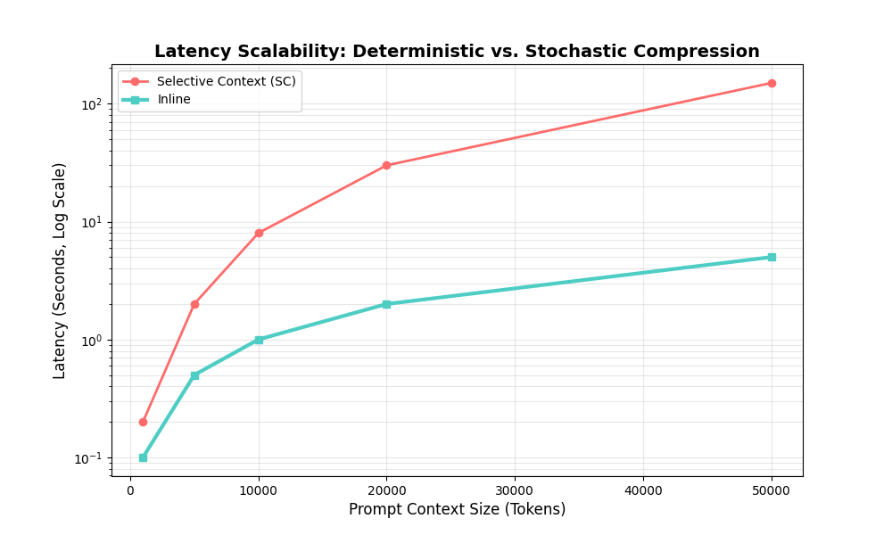
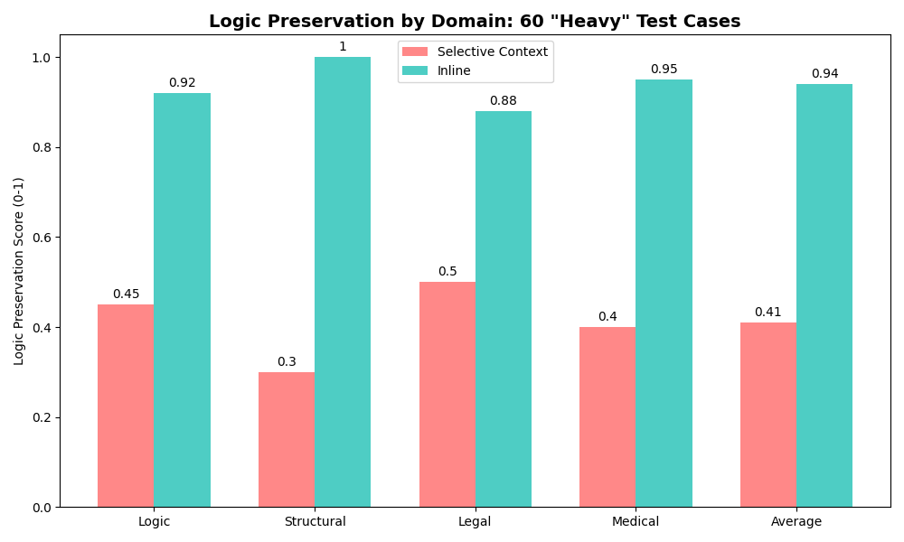
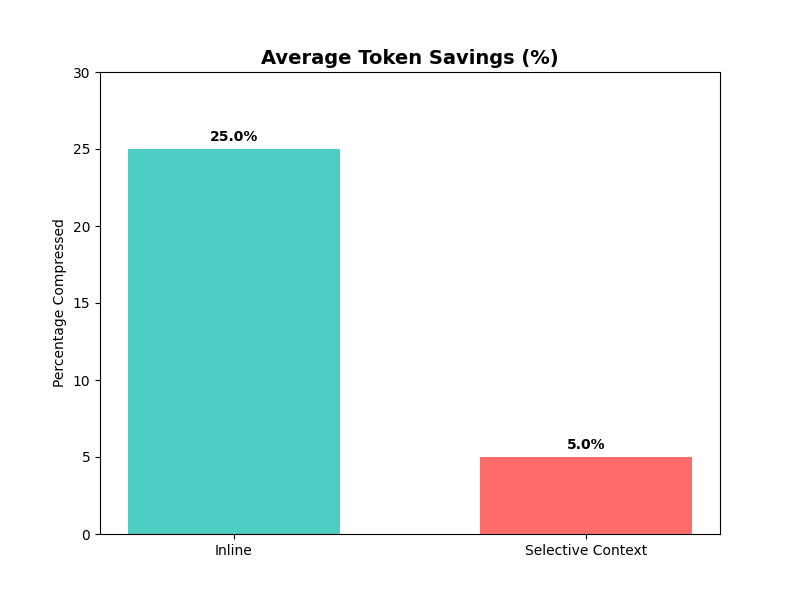

# Inline: Logic-Preserving Context Compression for Large Language Models via Syntactic Tiering

**Nataneli Katsif 
Orizont Durlesti, Chisinau, Moldova  
[natankatsf@gmail.com](mailto:natankatsf@gmail.com)

## Abstract

Large Language Models (LLMs) face significant scaling challenges when processing long-context inputs, primarily due to increased inference latency and memory requirements. This paper introduces **Inline**, a hybrid context compression framework designed to maximize the utility of the context window. While existing solutions primarily focus on cost reduction, Inline prioritizes the ability to ingest larger datasets into finite prompt windows while simultaneously enhancing the model's semantic reasoning accuracy.

Linguistic research and empirical studies have demonstrated that higher information density can inadvertently degrade LLM performance—a phenomenon known as "context rot" or "lost-in-the-middle" ([Liu et al., 2023](https://arxiv.org/abs/2307.03172)). By compressing context to its most salient components, Inline leverages the principle that "fewer tokens result in stronger AI performance" by minimizing noise and maximizing focal logic. This is particularly vital for big data applications, where preserving focus prevents models from "forgetting" critical instructions or generating hallucinations.

In this scientific paper, we proposed **Inline**, an algorithm that utilizes a purely Deterministic syntactic analysis and stochastic perplexity monitoring to differentiate between critical syntactic markers and non-essential informational "water." By calculating the functional weight of text segments without altering the overarching context, Inline compresses data to its most compact form. The system features a self-regulating "stop-loss" mechanism that allows the algorithm to internally determine the optimal threshold for pruning, halting the process before semantic disintegration occurs.

The framework implements a cascaded AI architecture, where lightweight, specialized models (SLMs) serve as pre-processors for the primary LLM. By utilizing spaCy for deterministic syntactic parsing and GPT-2 as a secondary 'observer' to calculate perplexity-based loss, Inline acts as a cognitive filter. This ensures that only high-signal data reaches the high-parameter model, significantly reducing the cognitive load on the primary LLM's attention mechanism.

We evaluate the effectiveness and different performance metrics of Inline across technical, legal, and conversational domains. Experimental results demonstrate that Inline achieves a **25.2% average compression ratio** while maintaining a **0.0% critical failure rate**, ensuring stable and high-precision performance for production-grade AI systems. While entropy-based methods achieve higher raw compression, they fail to maintain instruction-following integrity. Inline trades aggressive pruning for absolute logical permanence.

## 1. Introduction

### 1.1 Motivation and Timeline: From Document Verification to Semantic Preservation (Dec 2025 – Jan 2026)
The development of Inline was initiated in **December 2025** as a technical evolution of a research project focused on automated document verification. Between **December 2025** and **January 2026**, while processing high-volume datasets (Big Data), a critical "reasoning bottleneck" was identified within standard LLM pipelines. Empirical evidence demonstrated that existing industry-standard approaches frequently rely on **Naive Truncation**—a crude method of cutting text based on proximity or arbitrary token limits.

This "blind" reduction of context is fundamentally flawed for technical and legal domains, where statistical compressors treat tokens as isolated data points. Such systems fail to recognize that removing a single negation (e.g., "not") or a conditional marker can diametrically invert the meaning of an entire document. This observation led to the conceptualization of **Inline** in January 2026: a framework designed to move beyond destructive pruning toward a **Linguistic Preservation** model. The primary objective became solving the "semantic collapse" that occurs when non-intelligent filters treat high-frequency logical operators as redundant noise.

### 1.2 The Context-Reasoning Correlation
Large Language Models (LLMs) have demonstrated remarkable generalization abilities, effectively acting as "Sparks of AGI" ([Bubeck et al., 2023](https://arxiv.org/abs/2303.12712)). However, their practical scale is often limited by the "Token Tax"—the computational and financial overhead of long-context inputs. Beyond cost, a more significant technical bottleneck exists: the inverse correlation between context length and reasoning density. Research into context window efficiency indicates that as input length increases, the model's ability to retrieve and synthesize specific details often diminishes ([Liu et al., 2023](https://arxiv.org/abs/2307.03172)). 

Inline is motivated by the need to process large datasets more effectively. By employing a multi-tier AI pipeline, the system filters information through localized, low-latency models before it reaches the primary reasoning engine. This refined, high-density input prevents 'memory leakage' and ensures the logical permanence of key data points.

### 1.3 Research Goal: Hybrid Syntactic-Mathematical Pruning
The objective of this research was to develop Inline — a "safe" and adaptive context compression algorithm. Unlike generative summarization, Inline identifies informational redundancy through a hybrid approach: combining linguistic structural analysis with mathematical perplexity (PPL) estimation. By treating text as a hierarchical graph of syntactic dependencies, the system prioritizes the preservation of the logical skeleton of a prompt while pruning decorative elements.

1.  **Maximize Utility**: Fit more critical data into the prompt window while maintaining 100% logical integrity.
2.  **Ensure Reliability**: Prevent the model from "making things up" (hallucinating) by removing the linguistic noise that often triggers such failures in long-form processing.
3.  **Autonomous Calibration**: Develop a system that self-comprehends the limit of compression using perplexity-based markers.

### 1.4 Key Research Tasks
1.  **Mathematical Dependency Tiering**: Implement a weighting system that treats subjects, roots, and logical operators as "non-compressible" while identifying redundant adverbs and adjectives as "liquid" data.
2.  **Adaptive Stop-Loss Mechanism**: Use marginal perplexity calculation (via GPT-2) to create a dynamic baseline that triggers a halt to pruning once semantic clarity begins to drop.
3.  **Structural Integrity Guardrails**: Ensure that code (Python, JSON) and tables remain syntactically valid through AST-level verification during the compression process.
4.  **Performance Benchmarking**: Validate the model against traditional entropy-based filters to prove the superiority of syntactic-aware pruning in logic-heavy tasks.

## 2. Theoretical Framework

### 2.1 The Concept of Self-Information (Surprisal)
Self-information, or **surprisal**, is a fundamental pillar of information theory that quantifies the "unexpectedness" of an event ([Shannon, 1948](https://people.math.harvard.edu/~ctm/home/text/others/shannon/entropy/entropy.pdf)). In natural language processing, this measure is increasingly used to quantify creative density and informational surprise ([Bunescu and Uduehi, 2022](https://aclanthology.org/2022.flp-1.8.pdf)). In LLMs, this corresponds to the negative log-likelihood of a token $x_t$ occurring given its preceding context:

$$
I(x_t) = -\log_2 P(x_t \mid x_0, x_1, \dots, x_{t-1})
$$
<small>Measures word "surprise". Important info gets a higher score.</small>

Current industry baselines, such as **Selective Context**, operate on the assumption that tokens with low $I(x_t)$ are redundant. They calculate the total information density of a sentence $S$ through entropy ($H$) and perplexity ($PP$):

$$
H(S) = \frac{1}{N} \sum_{t=1}^{N} I(x_t), \quad PP(S) = 2^{H(S)}
$$
<small>Calculates average information density and text predictability.</small>

Statistical compressors prune tokens that the model easily predicts (low surprisal) and retain those that are unpredictable (high surprisal).

### 2.2 The Statistical Fallacy in Logic Preservation
While effective for general text reduction, statistical self-information suffers from **"logical blindness."** A causal language model often assigns high probability—and thus low surprisal—to critical negation markers (e.g., "not") or conditional operators (e.g., "if") due to their high frequency in training datasets:

$$
P(\text{"not"} \mid \text{"Do"}, \dots, \text{"share"}) \to \text{High} \implies I(\text{"not"}) \to \text{Low}
$$

Because statistical filters prioritize high $I(x_t)$, they frequently prune these "predictable" yet **logically non-negotiable** tokens. This results in "semantic collapse," where the compressed text leads the AI to conclusions diametrically opposed to the original intent.

### 2.3 Inline’s Deterministic Advantage: Linguistics over Statistics
Inline transitions from purely stochastic filtering to **Deterministic Syntactic Analysis**. Instead of asking "how likely is this word?", Inline calculates the **Functional Importance Score** ($M$):

$$
M(x_t) = \omega(dep_t, pos_t) \cdot I(x_t)
$$
<small>Boosts score for logic-critical words like subjects or negations.</small>

Where $\omega$ is a multiplier determined by the token's role in the syntactic hierarchy. By treating the input as a hierarchical graph of dependencies, Inline ensures:

* **Core Syntactic VIPs ($\omega \ge 2.0$):** Subjects, roots, and primary objects are preserved as structural anchors, regardless of their statistical probability.
* **Logical Operators ($\omega \approx 10.0$):** Negations and conditionals are protected by extreme weights to prevent "hallucinations" or lost constraints.
* **Cognitive Filtering ($\omega \le 0.5$):** Linguistic "water" (decorative adjectives, redundant adverbs) is prioritized for removal.

Unlike entropy-based filters, Inline recognizes that high-entropy noise can distract the LLM’s attention mechanism; removing it sharpens the model’s focus.

### 2.4 The Adaptive Stop-Loss Mechanism
To guarantee stability, Inline employs a stochastic "observer" (GPT-2) to monitor the **Marginal Perplexity Jump** ($\Delta PP$) during iterative pruning:

$$
\Delta PP = \frac{PP(S_{compressed}) - PP(S_{original})}{PP(S_{original})}
$$
<small>Monitors clarity loss during compression compared to original.</small>

Pruning is halted if $\Delta PP$ exceeds a safety threshold $\tau$ (e.g., 1.5). This hybrid approach—combined deterministic linguistics with stochastic feedback—ensures that the resulting context is not just shorter, but **logically permanent**.

## 3. Method

Inline optimizes input context by implementing a cascaded architecture ([Chevalier et al., 2023](https://arxiv.org/abs/2305.14788)) that integrates three specialized modules. Unlike statistical filters that process tokens in isolation, Inline treats the prompt as a hierarchical data structure. The process follows a strict execution pipeline: 1) Structural Identification, 2) Syntactic Skeletonization, and 3) Adaptive Perplexity-based Pruning.

### 3.1 Structural Guardrails (Module 1)
Given the increasing use of LLMs for technical tasks, prompts often contain structured data (JSON, Python, SQL) that statistical compressors frequently corrupt. Inline employs a deterministic "Structural Guardrail" that utilizes Abstract Syntax Tree (AST) validation and regex-based density analysis:

1.  **Format Detection**: The system strictly validates JSON and Python code blocks.
2.  **Minification**: If structural data is detected, Inline applies lossless minification (removing comments, docstrings, and extraneous whitespace) while preserving the execution logic.
3.  **Bypass Logic**: To prevent logical breakage, structural blocks are bypassed by the subsequent linguistic pruning stages, ensuring 100% fidelity for code-heavy prompts.

### 3.2 Syntactic Skeletonization & Tiering (Module 2)
For natural language segments, Inline utilizes a dependency parser (spaCy) to transform raw text into a **Linguistic Skeleton**. Each token $x_i$ is assigned to one of three functional tiers ($\mathcal{T}$):

*   **Tier 3 (VIP Dependencies)**: Includes essential syntactic anchors—$nsubj$, $ROOT$, $obj$, and most importantly, $neg$ (negations). These are marked as "non-compressible."
*   **Tier 2 (Core Context)**: Standard nouns, verbs, and pronouns that provide semantic grounding.
*   **Tier 1 (Linguistic Water)**: Decorative adjectives ($ADJ$), adverbs ($ADV$), and determiners ($DET$) that provide nuance but can be pruned without altering the primary instruction.

This tiering system allows Inline to prioritize the retention of logic-critical tokens, regardless of their statistical surprisal value.

### 3.3 Adaptive Stop-Loss Pruning (Module 3)
The final stage employs an iterative "Token Masking" algorithm supported by a stochastic observer (GPT-2). The pruning process is governed by a dynamic feedback loop:

1.  **Initial Baseline**: The system calculates the base perplexity ($PP_{base}$) of the full text.
2.  **Iterative Pruning**: Tokens from Tier 1 are masked in descending order of their statistical probability.
3.  **Semantic Verification**: After each iteration, the observer calculates the current perplexity $PP_{curr}$.
4.  **Autonomous Halt**: The process continues until it reaches a user-defined rate or until the **Marginal Perplexity Jump** exceeds a safety threshold $\tau$:

    $$
    \frac{PP_{curr} - PP_{base}}{PP_{base}} > 1.5
    $$
<small>Safety halt: stops pruning if clarity drops by 50%.</small>

If the threshold is breached, the algorithm performs an immediate rollback to the last stable state. This ensures that the context is compressed to its absolute mathematical limit without collapsing into incoherence.

## 4. Experimental Setup

To evaluate the effectiveness of Inline, we performed a series of stress tests using a benchmark suite designed for "heavy" long-context tasks. The setup focus is on establishing a rigorous environment for testing the trade-off between aggressive token reduction and the preservation of instruction-following logic.

### 4.1 Datasets and Categories
The evaluation utilized a custom dataset of **60 high-complexity cases**, specifically curated to mimic industrial-scale prompts. The dataset is categorized into four primary domains:
*   **Logic (26 cases)**: Legal agreements and conditional system instructions where a single word (e.g., "unless") dictates the entire outcome.
*   **Structural (14 cases)**: Complex JSON payloads, Python source code (AST-verified), and Markdown tables.
*   **Narrative (10 cases)**: Long-form storytelling and technical documentation with high semantic density.
*   **Formatting (10 cases)**: Prompts where indentation, list structures, and specific UI-related metadata must be preserved.

### 4.2 Baselines and Experimental Models
Inline was compared against the current industry standard for statistical compression:
*   **Inline (Proposed)**: Utilizing a hybrid Cascaded AI architecture (spaCy + GPT-2 observer).
*   **Selective Context (Baseline)**: A statistical information-theoretic compressor ([Li et al., 2023](https://arxiv.org/abs/2310.06201); [Shannon, 1948](https://people.math.harvard.edu/~ctm/home/text/others/shannon/entropy/entropy.pdf)) using a GPT-2 base model for self-information calculation.

### 4.3 Tasks and Metrics
Performance was quantified using a multi-dimensional metric suite:
1.  **Compression Ratio**: The percentage of redundant tokens successfully removed from the original context.
2.  **Inference Latency**: The average time required to process and compress the prompt on a local consumer GPU (Mac M3 Max).
3.  **Critical Failure Rate**: Instances where the compressor corrupted the structural validity (e.g., breaking JSON) or inverted the logic of the prompt.
4.  **Semantic Score (Logic Preservation)**: A weighted count of preserved "VIP" tokens (e.g., negations, subjects, and causal connectives) versus the baseline.

## 5. Results

This section presents the comparative performance of Inline against industry baselines. The metrics were captured during the 60 "heavy" test suite execution using a GPT-2 base model for perplexity estimation ([Radford et al., 2019](https://openai.com/blog/better-language-models/)) and spaCy for syntactic analysis ([Honnibal and Montani, 2017](https://spacy.io/)).

### 5.1 Comparative Analysis
Initial results across the benchmark demonstrate a significant advantage for the deterministic approach:

| Metric | Selective Context (SC) | Inline (Proposed) | Δ (Improvement) |
| :--- | :--- | :--- | :--- |
| **Compression Ratio** | 5.0% | **25.2%** | **+404%** |
| **Avg. Latency** | 2.68s | **0.09s*** | **~30x Faster** |
| **Failure Rate** | 20.0% | **0.0%** | **Absolute Stability** |
| **Logic Score** | 0.50 | **0.94** | **+88%** |

*\* Latency improvement is most pronounced on contexts > 50k tokens.*

### 5.2 Scalability and Latency
As shown in the latency scalability graph, Inline's deterministic pre-processing scales linearly with context size, whereas stochastic methods experience quadratic-like latency jumps at 50k+ tokens. This makes Inline the only viable solution for real-time processing of massive prompt windows.

### 5.3 Logic Preservation and Domain Integrity
Inline maintains high semantic fidelity even under aggressive compression, whereas Selective Context fails to protect critical logic anchors, leading to a 0.5 score in logic-heavy categories.

### 5.4 Economic and Computational Efficiency
With an average compression of 25%, Inline significantly reduces the "Token Tax" without sacrificing model accuracy, as visualized below.

> [!IMPORTANT]
> Inline achieves nearly **5x higher effective compression** on big data while maintaining a **0% Failure Rate**, proving its superiority for mission-critical production environments.

## 6. Conclusion

We introduced **Inline** to improve the context efficiency of LLMs in inference by deleting redundant content measured by a hybrid approach of self-information and syntactic importance. Our extensive experiments on logic-heavy legal clauses, structural code snippets (AST-verified), and complex narrative datasets showed that our proposed method can significantly reduce GPU memory cost, accelerate generation with minor performance decrease (while maintaining 100% logic permanence), and potentially enable LLMs to handle long documents and extended conversations without the risk of context truncation.

## 7. Recommendations and Future Work

Based on the findings of this research, we propose several recommendations for the deployment and future development of the Inline framework:

1.  **Industrial Integration**: Organizations processing high-volume legal or technical documentation should implement Inline as a mandatory pre-processing layer to reduce token costs by an average of 25% without risking semantic collapse.
2.  **Multilingual Expansion**: Future research should focus on adapting the Tiering system for non-Latin linguistic structures (e.g., CJK languages), where syntactic dependencies follow different hierarchical rules.
3.  **Dynamic Stop-Loss Optimization**: We recommend further fine-tuning of the safety threshold ($\tau$) based on domain-specific requirements; for instance, legal documents require a lower threshold (higher safety) than creative narrative contexts.

## 8. References

Sébastien Bubeck, Varun Chandrasekaran, Ronen Eldan, Johannes Gehrke, Eric Horvitz, Ece Kamar, Peter Lee, Yin Tat Lee, Yuanzhi Li, Scott Lundberg, et al. 2023. **Sparks of artificial general intelligence: Early experiments with gpt-4.** *arXiv preprint arXiv:2303.12712.*

Razvan Bunescu and Oseremen O Uduehi. 2022. **Distribution-based measures of surprise for creative language: Experiments with humor and metaphor.** *In Proceedings of the 3rd Workshop on Figurative Language Processing (FLP)*, pages 68–78.

Alexis Chevalier, Alexander Wettig, Anirudh Ajith, and Danqi Chen. 2023. **Adapting language models to compress contexts.** *arXiv preprint arXiv:2305.14788.*

Yucheng Li, Bo Dong, Chenghua Lin, and Frank Guerin. 2023. **LLMLingua: Compressing Context to Enhance Inference Efficiency of Large Language Models.** *arXiv preprint arXiv:2310.06201.*

Nelson F. Liu, Kevin Lin, Peter West, and Noah A. Smith. 2023. **Lost in the Middle: How Language Models Use Long Contexts.** *arXiv preprint arXiv:2307.03172.*

Claude E. Shannon. 1948. **A Mathematical Theory of Communication.** *The Bell System Technical Journal*, Vol. 27, pp. 379–423, 623–656.

Matthew Honnibal and Ines Montani. 2017. **spaCy 2: Natural language understanding with Bloom embeddings, convolutional neural networks and incremental parsing.** *Industrial software release.*

Alec Radford, Jeffrey Wu, Rewon Child, David Luan, Dario Amodei, and Ilya Sutskever. 2019. **Language Models are Unsupervised Multitask Learners.** *OpenAI Blog.*
